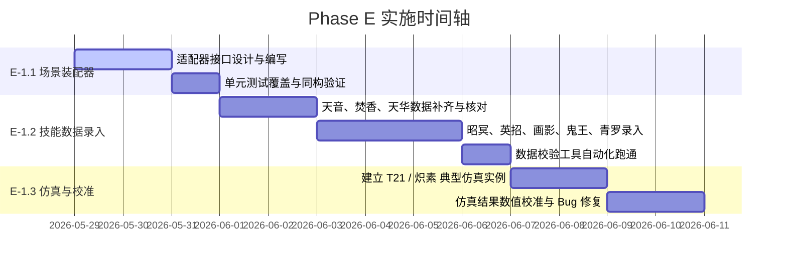

# 诛仙3团队副本模拟训练场 — Phase E 核心数据录入与校准设计方案

## 方案目标

本阶段（Phase E）的核心目标是完成**仿真数据的全面丰富与数值校准**，为 Phase F (Web UI) 提供坚实的数据支撑，并实现**自动场景装配适配器 (`assembleScenario`)**。

主要包含以下几个核心模块：
1. **E-1.1: 自动场景装配适配器 (`scenario_assembler.ts`)**：作为数据层的“胶水模块”，提供纯函数 API，将高层的 Profile、配队及 Boss 选择与静态 `skills.json` 数据库无缝组装，生成标准的 `SimulationScenario`。
2. **E-1.2: 补齐 8 辅助与 3 输出的核心技能数据 (`skills.json`)**：对天音、焚香进行最终确认，并补充天华、昭冥、英招、画影、鬼王、青罗等其余辅助职业的 Buff/Debuff。
3. **E-1.3: 真实副本 Boss 数据校验与数值校准**：补齐 `dungeons_monsters.json` 属性，建立典型的 T21 / 天帝宝库仿真实例，校验整个时间轴的覆盖率与击杀 DPS。

---

## 自动场景装配适配器 API 设计

为了确保适配器在 Node.js (CLI 校验与测试环境) 和浏览器 (Vite + Web UI) 中完全**同构 (Isomorphic)**，`assembleScenario` 将作为无侧效应的纯函数实现。

### 1. 核心数据接口定义 (`types.ts`)

```typescript
// DPS Actor 组装输入
export interface AssemblerDpsActorInput {
  actorId: string;                   // 角色实例 ID (例如 "dps_shuanghua")
  classId: string;                   // 职业 ID (例如 "ZHU_SHUANG")
  faction: 'XIAN' | 'FO' | 'MO';     // 阵营
  profileAttributes: CharacterAttributes; // 玩家 Profile 面板白板属性
  skillOverrides?: Record<string, PlayerSkillOverride>; // 个性化覆盖与四代技能品质
  strategy: DpsStrategyConfig;       // DPS 输出策略
  skillIds?: string[];               // 可选：限制装配技能白名单，策略引用技能会自动补入
  gcdMs?: number;
}

// 辅助 Actor 组装输入
export interface AssemblerSupportActorInput {
  actorId: string;                   // 辅助角色实例 ID (例如 "support_tianyin")
  classId: string;                   // 职业 ID (例如 "TIAN_YIN")
  faction: 'XIAN' | 'FO' | 'MO';     // 阵营
  profileAttributes?: CharacterAttributes; // 动态缩放技能需要来源属性时必填
  strategy?: SupportStrategyConfig;  // 辅助出招策略，若不填则由系统生成默认策略
  skillOverrides?: Record<string, PlayerSkillOverride>;
  skillIds?: string[];               // 可选：限制装配辅助技能白名单
  gcdMs?: number;
}

// 整体组装入参
export interface AssembleScenarioInput {
  scenarioId?: string;
  maxTimeMs: number;                 // 模拟最大时长
  dungeonId?: string;                // 副本 ID；不填时全局查 Boss，重名会要求补 dungeonId
  bossId: string;                    // Boss ID
  bossHealthOverride?: number;       // 临时 Boss 血量覆写
  dpsActor: AssemblerDpsActorInput;  // 主输出配置
  supports?: AssemblerSupportActorInput[]; // 辅助小队列表 (最多支持 5人 或 11人)
  attributeCaps?: AttributeCapsConfig; // 全局数值上限配置
  gcdMs?: number;
}
```

### 2. 适配器纯函数定义 (`scenario_assembler.ts`)

```typescript
import type {
  AssembleScenarioInput,
  SimulationScenario,
  AllSkills,
  Monster
} from './types.js';

/**
 * 自动场景装配纯函数
 * @param input 玩家高层配置
 * @param gameData 静态数据库引用
 */
export function assembleScenario(
  input: AssembleScenarioInput,
  gameData: {
    skills: AllSkills;
    monstersByDungeon: Record<string, Monster[]>;
  }
): SimulationScenario;
```

#### 组装器内部处理规则：
1. **Boss 匹配与解析**：
   从 `gameData.monstersByDungeon` 中检索指定的 `dungeonId` 和 `bossId`，提取 Boss 模版。若 `bossHealthOverride` 存在，则覆盖 Boss 血量。
2. **DPS Actor 组装**：
   * 扫描静态库中 `classId` 为该输出职业且 Faction 匹配该阵营（或通用 `COMMON` 技能）的所有伤害技能。
   * 自动混入 `profileAttributes` 作为 `baseAttributes`。
   * 合并 `skillOverrides` 并挂载 `strategy`。
3. **Support Actor 组装**：
   * 扫描静态库中该辅助职业下，`ActionType` 为 `BUFF` / `DEBUFF` / `UTILITY` 的全部辅助类技能。
   * **策略缺省处理**：若 `strategy` 为空，自动生成一个默认策略，将该职业所有录入的辅助技能按照“好了就放 `CAST_ON_READY`”规则平铺排班，并默认把 `targetActorId` 指向主输出，保证 `ALLY` 类 Buff 可落到主输出身上。
   * 如果辅助技能或四代预设包含 `DynamicScaling*` 动态缩放字段，则该辅助 Actor 必须提供 `profileAttributes`，否则装配阶段提前失败。

### 3. 本轮实施调整

- 当前仓库尚无独立 `validateScenario`，因此 E-1.1 的自动测试采用 `validateSkillsData` 校验技能 fixture，再调用 `runSimulation` 验证装配结果可稳定运行。
- 职业/阵营技能排序采用“指定阵营优先，COMMON 追加”的稳定顺序；若同 ID 同时存在，阵营技能优先。
- 装配器保持纯函数，不读取 `fs/path`，Node CLI 与 Web UI 都可 import。

---

## 核心数据录入职业清单 (录入规划)

根据《诛仙3》主流团队副本的实际增益，Phase E 将严格补齐以下 8 个辅助职业 and 3 个核心输出职业的数据。

### 1. 辅助职业 (8 大辅助)

| 职业 ID | 职业名称 | 阵营建议 | 核心 Buff / Debuff 录入范围 |
| :--- | :--- | :--- | :--- |
| `TIAN_YIN` | 天音 | 佛 | 慈航法愿 (专注增益)、无量真言/无量真言·禅 (令怪受伤增加 15%)、大慈悲 (气血上限)、天舞宝轮 (攻击力100%破防)、摩柯心经 (固定气血动态加成) |
| `FEN_XIANG` | 焚香 | 佛 | 祝融真典2 (全队 30% 专注)、炎兵灸魂 (绿点倍增器)、绝情殇 (令怪受伤增加 60%)、赤乌·三味真火 (令怪受伤增加 50%)、南巫天火·禅 (攻击力100%破防) |
| `TIAN_HUA` | 天华 | 佛/升仙 | 鸣泉雅音/济世清音 (属性增益)、九雅/行云流水 (高额爆伤与专注)、镜花水月 (反弹光环等辅助功能) |
| `ZHAO_MING` | 昭冥 | 佛 | 日月弘光 (多阶段切换，1段15%攻击/2段30%攻击与150%爆伤)、绝煞·照影 (令怪受伤增加)、功能性附身状态 |
| `YING_ZHAO` | 英招 | 佛/仙 | 纵横天下/背水一战 (团队防御与受击减免)、阻截/狂攻阵法 (团队攻击与移速、暴击加成) |
| `HUA_YING` | 画影 | 佛 | 惊神引 (令怪受伤增加)、浩渺无极 (属性增强)、云生画影 (减伤与生存辅助) |
| `GUI_WANG` | 鬼王 | 仙/佛/魔 | 猛火咒/冷嘲热讽 (拉仇恨与团队辅助)、指天骂地 (降低 Boss 防御属性)、未名斩等减益特效 |
| `QING_LUO` | 青罗 | 仙/佛 | 彤云扫天/扇底风 (提供团队极速 Haste 压缩施法时间)、绿水摇飏 (削弱 Boss 抗性/防御) |

### 2. 输出职业 (3 大主力)

目前已具备基础框架，在 Phase E 中进行完整主力伤害技能的伤害公式校准：
* **逐霜 (`ZHU_SHUANG`)**：苍龙啸多段命中与充能、临渊敛爪、山雨欲来等。
* **太昊 (`TAI_HAO`)**：天地绝、伏虎意等高频段数连招。
* **涅羽 (`NIE_YU`)**：大业浮屠、刹羽无名等毒系与爆发连招。

---

## 阶段 E 实施步骤



---

## 验证与验收标准

1. **自动场景装配测试**：
   * 编写单元测试 `test_assembler.ts`，输入 DPS Profile 和辅助小队，输出的 `SimulationScenario` 必须能通过技能数据校验并顺利运行模拟。
   * 确保无 Node.js 特有模块（如 `fs`、`path`）硬编码在适配器中，可在前端沙盒中顺利 import。
2. **数据一致性校验**：
   * 执行 `npm run check:all` 确保没有 TypeScript 编译错误。
   * 所有新增技能的 `ExclusiveGroup`、`ActionType`、`HitTiming` 等无空置，字段格式完全匹配。
3. **仿真校准表现**：
   * 运行真实组装的场景，在 8 大辅助 Buff/Debuff 全开下，DPS 的增幅比率需符合《诛仙3》实际公式结算，无突变和指数级异常值。
