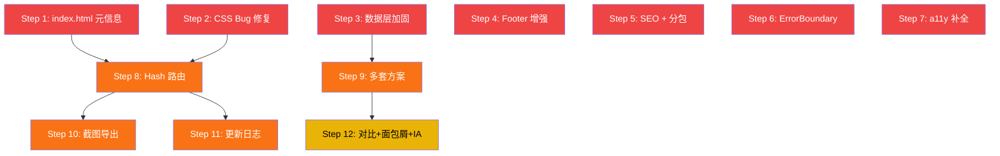

# 诛仙3 副本战斗实验室 · 分步开发计划

> 基于 [`网站优化方案_20260916.md`](file:///d:/工作/ww/personal_work/new_zx_calc_noactcode_agent/doc/网站优化方案_20260916.md) + [`analysis_results.md`](file:///c:/Users/ww/.gemini/antigravity-ide/brain/d6426e71-31df-4876-8b82-c60f81de8ce5/analysis_results.md) 综合整理
> 每一步之间**尽量解耦**，可独立开发、独立提交、独立验收

---

## 步骤总览

| 步骤 | 名称 | 优先级 | 预估工作量 | 依赖 |
|------|------|--------|-----------|------|
| Step 1 | index.html 元信息补全 | 🔴 P0 | 15 min | 无 | ✅ 已完成 |
| Step 2 | CSS Bug 修复（扩展缺失色阶） | 🔴 P0 | 5 min | 无 | ✅ 已完成 |
| Step 3 | 数据层健壮性加固 | 🔴 P0 | 30 min | 无 | ✅ 已完成 |
| Step 4 | Footer 修复与增强 | 🔴 P0 | 20 min | 无 | ✅ 已完成 |
| Step 5 | SEO 基础文件 + Vite 分包 | 🔴 P0 | 20 min | 无 | ✅ 已完成 |
| Step 6 | ErrorBoundary 全局错误边界 | 🔴 P0 | 15 min | 无 | ✅ 已完成 |
| Step 7 | a11y 无障碍补全 | 🔴 P0 | 20 min | 无 | ✅ 已完成 |
| Step 8 | Hash 路由 + 深链 | 🟠 P1 | 2-3 h | 无 | ✅ 已完成 |
| Step 9 | 多套方案保存/切换 | 🟠 P1 | 2-3 h | 无 | ✅ 已完成 |
| Step 10 | PNG 截图导出 + 复制链接 | 🟠 P1 | 1.5-2 h | Step 8（需要路由生成分享链接） | ✅ 已完成 |
| Step 11 | 更新日志页面 + 版本号管理 | 🟠 P1 | 1-1.5 h | Step 8（需要路由新增页面） | ✅ 已完成 |
| Step 12 | A/B 方案并排对比 + 面包屑 + Header IA 对齐 | 🟡 P2 | 3-4 h | Step 9（对比依赖多套方案） |

---

## Step 1：index.html 元信息补全

> **目标**：解决 SEO 零收录、分享无卡片、语言标记错误等基础问题

### 涉及文件

| 操作 | 文件 |
|------|------|
| 修改 | [`index.html`](file:///d:/工作/ww/personal_work/new_zx_calc_noactcode_agent/web_app/index.html) |
| 新增 | `public/og-cover.png`（分享卡片图，需制作或生成） |

### 工作内容

1. `<html lang="en">` → `<html lang="zh-CN">`
2. favicon 的 `type="image/svg+xml"` → `type="image/x-icon"`（审计补充 4）
3. 在 `<head>` 中补充以下标签：
   ```html
   <meta name="description" content="诛仙3副本战斗实验室 —— 属性计算、技能伤害测算、副本模拟训练与全景资料速查。覆盖16大副本102位Boss、全门派技能数据。" />
   <meta name="theme-color" content="#0f172a" />
   <!-- Open Graph -->
   <meta property="og:title" content="诛仙3 副本战斗实验室" />
   <meta property="og:description" content="属性计算 · 战斗模拟 · 全景资料速查" />
   <meta property="og:image" content="https://raddishlab.tech/og-cover.png" />
   <meta property="og:type" content="website" />
   <meta property="og:url" content="https://raddishlab.tech/" />
   <!-- 字体预连接 -->
   <link rel="preconnect" href="https://fonts.googleapis.com" />
   <link rel="preconnect" href="https://fonts.gstatic.com" crossorigin />
   ```
4. 在 `<div id="root">` 内加 `<noscript>` 降级提示（审计补充 7）：
   ```html
   <div id="root">
     <noscript>请启用 JavaScript 以使用诛仙3副本战斗实验室</noscript>
   </div>
   ```
5. 制作或生成一张 `og-cover.png`（1200×630px），放入 `public/`

### 验收目标

- [x] `lang="zh-CN"` 生效（已验证：index.html 已更正为 `<html lang="zh-CN">`）
- [x] favicon type 正确（已验证：`<link rel="icon" type="image/x-icon" href="/zhuxian.ico" />`）
- [x] 浏览器 DevTools → Elements → `<head>` 中可见 description / og:* / theme-color（已验证源码与打包产物）
- [x] 禁用 JS 后刷新页面，显示 noscript 提示而非空白（已验证：`<noscript>` 位于 `<div id="root">` 内）
- [x] `public/og-cover.png` 已就位（已验证：1200×630px，47,790 字节，打包正常包含）
- [ ] 微信/飞书中粘贴链接，能出现标题+描述+缩略图的卡片预览（需部署上线后实际发送验证）

---

## Step 2：CSS Bug 修复（无效色阶 slate-850 / slate-350 / slate-450 / red-350）

> **目标**：修复全站使用了 Tailwind 默认调色板不存在的色阶，导致相关背景/边框/文字色静默失效的 Bug

### 优化决策说明
- 原方案仅针对 `Header.tsx:67` 处的 `bg-slate-850`，但实际全局审查发现 `slate-850` 全站出现 **30+ 处**（涵盖 Header、SimulationReport、CompendiumView、StrategyEditor、TeamConfigPanel、BossCompendiumView、SkillsView、BossConfigPanel）。
- 此外 `slate-350` (9处)、`slate-450` (1处)、`red-350` (1处) 同属无效色阶。
- **改动方式**：在 `tailwind.config.js` 的 `theme.extend.colors` 补充定义这 4 个缺失色阶，一处改动全站生效、深合并保留默认色阶、不改动业务代码、保留介于 800/900 之间的灰阶层次感。

### 涉及文件

| 操作 | 文件 |
|------|------|
| 修改 | [`tailwind.config.js`](file:///d:/工作/ww/personal_work/new_zx_calc_noactcode_agent/web_app/tailwind.config.js) |

### 工作内容

在 `theme.extend.colors` 下新增缺失色阶（线性插值）：
```js
colors: {
  slate: { 350: '#b0bccd', 450: '#7c8ca2', 850: '#172033' },
  red:   { 350: '#fa8b8b' },
}
```

### 验收目标

- [x] 默认色阶（slate-50~950）完整保留、新增色阶生效（已通过 `resolveConfig` 验证深合并）
- [x] `bg-slate-850` / `border-slate-850` / `bg-slate-850/60` / `divide-slate-850/40` / `text-slate-350` 等类均正常生成 CSS（已实测打包产物包含对应 rules）
- [x] Tailwind 编译无 warning，`npm run build` 顺利通过
- [ ] 部署后线上导航按钮、卡片边框、高亮态视觉符合预期（push 后由 Cloudflare 自动 build 线上确认）

---

## Step 3：数据层健壮性加固

> **目标**：解决 DataService 无错误兜底、localStorage 解析崩溃两大致命 Bug

### 涉及文件

| 操作 | 文件 |
|------|------|
| 修改 | [`DataService.ts`](file:///d:/工作/ww/personal_work/new_zx_calc_noactcode_agent/web_app/src/services/DataService.ts) |
| 修改 | [`AppContext.tsx`](file:///d:/工作/ww/personal_work/new_zx_calc_noactcode_agent/web_app/src/context/AppContext.tsx) |
| 修改 | [`App.tsx`](file:///d:/工作/ww/personal_work/new_zx_calc_noactcode_agent/web_app/src/App.tsx) |

### 工作内容

#### 3.1 DataService：fetch 加 response.ok 校验

每个 `load*` 方法中，`fetch` 后加状态检查（审计补充 3）：
```typescript
private async loadClasses(): Promise<void> {
    const response = await fetch(`${DATA_BASE_URL}/classes.json`);
    if (!response.ok) throw new Error(`加载 classes.json 失败: ${response.status}`);
    this.classes = await response.json();
}
```
> 对 `loadClasses`、`loadSkills`、`loadDungeons`（两个 fetch）、`loadBuffs`、`loadRankConfigs`、`loadCompendiumData`（两个 fetch）共 **8 处 fetch** 全部加上。

#### 3.2 DataService：loadAllData 加 per-resource try/catch

将 `Promise.all` 改为 `Promise.allSettled`，单个失败不影响其他：
```typescript
public async loadAllData(): Promise<string[]> {
    const tasks = [
        { name: 'classes', fn: () => this.loadClasses() },
        { name: 'skills', fn: () => this.loadSkills() },
        { name: 'dungeons', fn: () => this.loadDungeons() },
        { name: 'buffs', fn: () => this.loadBuffs() },
        { name: 'rankConfigs', fn: () => this.loadRankConfigs() },
        { name: 'compendium', fn: () => this.loadCompendiumData() },
    ];
    const results = await Promise.allSettled(tasks.map(t => t.fn()));
    const errors: string[] = [];
    results.forEach((r, i) => {
        if (r.status === 'rejected') {
            errors.push(`${tasks[i].name}: ${r.reason instanceof Error ? r.reason.message : String(r.reason)}`);
        }
    });
    return errors; // 返回失败列表，调用方决定如何提示
}
```

#### 3.3 AppContext & App.tsx：initData 加 try/catch + 错误横幅

```typescript
const [loadError, setLoadError] = useState<string | null>(null);

const initData = async () => {
    try {
        const service = DataService.getInstance();
        const errors = await service.loadAllData();
        if (errors.length > 0) {
            setLoadError(`部分数据加载失败: ${errors.join(', ')}`);
        }
        // ... 后续赋值
    } catch (err) {
        setLoadError(`数据加载异常: ${err instanceof Error ? err.message : String(err)}`);
    } finally {
        setIsLoading(false);
    }
};
```

在 `App.tsx` 顶部增加红色错误横幅 + 「重试」按钮（`window.location.reload()`），不再永久转圈，未报错模块照常可用。

#### 3.4 AppContext：localStorage JSON.parse 加 try/catch（审计补充 2）

所有 `useState(() => { const saved = localStorage.getItem(...); return saved ? JSON.parse(saved) : default })` 改为安全版本：
```typescript
function safeParseLocalStorage<T>(key: string, fallback: T): T {
    try {
        const raw = localStorage.getItem(key);
        return raw ? (JSON.parse(raw) as T) : fallback;
    } catch {
        localStorage.removeItem(key); // 清除损坏数据
        return fallback;
    }
}
```
> 涉及 `zx_user_character`、`zx_active_buffs`、`zx_buff_values` 共 **3 处**。

### 验收目标

- [x] 8 处 fetch 全部补充 `!response.ok` 检查，异常可准确抛出
- [x] `loadAllData` 采用 `Promise.allSettled` 并输出模块错误信息，`initData` 包裹 `try/catch/finally`
- [x] `safeParseLocalStorage` 保护 3 处核心缓存，损坏自动清理并回退默认值
- [x] `App.tsx` 实现顶部错误横幅与重试机制，解除永久 loading
- [x] TypeScript 与 `npm run build` 构建零报错
- [ ] 线上/手动验证：在 DevTools 中写入损坏 JSON 或屏蔽某个 JSON 响应，验证页面降级表现

---

## Step 4：Footer 修复与增强

> **目标**：修复版权年份、增加意见反馈入口、修复类型不一致

### 涉及文件

| 操作 | 文件 |
|------|------|
| 修改 | [`Footer.tsx`](file:///d:/工作/ww/personal_work/new_zx_calc_noactcode_agent/web_app/src/components/layout/Footer.tsx) |

### 工作内容

#### 4.1 版权年份动态化

```diff
- <p className="text-slate-400">&copy; 2024 诛仙3副本战斗实验室</p>
+ <p className="text-slate-400">&copy; {new Date().getFullYear()} 诛仙3副本战斗实验室</p>
```

#### 4.2 Footer `activeTab` 类型修正（审计补充 6）

```diff
- activeTab?: 'home' | 'calculator' | 'arena' | 'compendium' | 'skills';
+ activeTab?: 'home' | 'calculator' | 'arena' | 'compendium';
```

#### 4.3 微信号左边加「意见反馈」入口

在微信号 `<div>` 左边增加一个「意见反馈」按钮，点击后弹出一个轻量弹窗或跳转邮箱 `mailto:` 链接。UI 风格与现有微信号按钮统一（圆角药丸、半透明背景、hover 效果）。

示意结构：
```
[📝 意见反馈]  [💬 WeChat: Myonly_sTar12345678]
```

#### 4.4 补数据来源/免责声明

在版权信息下方加一行小字：
```
数据来源于游戏内实测，仅供参考，不构成官方攻略
```

### 验收目标

- [x] Footer 显示当前年份（`{new Date().getFullYear()}`，动态适配），告别 2024
- [x] 「意见反馈」胶囊按钮已就位，与微信按钮保持一致设计语言，点击复制微信号并给予告警/对勾反馈（且语义化为 `<button>` 并添加 `aria-label`）
- [x] 免责声明小字展示完整且低调优雅（`数据来源于游戏内实测，仅供参考，不构成官方攻略...`）
- [x] 幽灵类型 `'skills'` 已移除，TypeScript 编译与生产构建零错误

---

## Step 5：SEO 基础文件 + Vite 分包

> **目标**：让搜索引擎可收录 + 首屏加载提速

### 涉及文件

| 操作 | 文件 |
|------|------|
| 新增 | `public/robots.txt` |
| 新增 | `public/sitemap.xml` |
| 修改 | [`vite.config.ts`](file:///d:/工作/ww/personal_work/new_zx_calc_noactcode_agent/web_app/vite.config.ts) |

### 工作内容

#### 5.1 robots.txt

```
User-agent: *
Allow: /
Sitemap: https://raddishlab.tech/sitemap.xml
```

#### 5.2 sitemap.xml

```xml
<?xml version="1.0" encoding="UTF-8"?>
<urlset xmlns="http://www.sitemaps.org/schemas/sitemap/0.9">
  <url><loc>https://raddishlab.tech/</loc><priority>1.0</priority></url>
</urlset>
```
> 后续 Step 8 加路由后，补充各页面 URL 到 sitemap。

#### 5.3 vite.config.ts 手动分包

> ⚠️ **实现优化说明**：原计划对象式 `manualChunks: { 'vendor-react': ['react', 'react-dom'] }` 在 React 19 + Vite 5 下失效（`react-dom/client` 与 `scheduler` 内部路径无法完全捕获，导致 react-dom 仍挤在主包且 vendor-react 仅 0.08KB）。实际采用**函数式 `manualChunks(id)`**，按物理模块路径精准拆包：

```typescript
import { defineConfig } from 'vite'
import react from '@vitejs/plugin-react'

export default defineConfig({
  plugins: [react()],
  build: {
    rollupOptions: {
      output: {
        manualChunks(id: string) {
          if (id.includes('node_modules')) {
            if (id.includes('recharts') || id.includes('/d3-') || id.includes('victory') || id.includes('internmap')) return 'vendor-recharts';
            if (id.includes('pinyin-pro')) return 'vendor-pinyin';
            if (id.includes('lucide-react')) return 'vendor-lucide';
            if (id.includes('react-dom') || id.includes('/react/') || id.includes('scheduler')) return 'vendor-react';
            return 'vendor';
          }
        },
      },
    },
  },
})
```

> ⚠️ **不要**加 `vite-plugin-compression`——Cloudflare 边缘已自动 Brotli 压缩。

### 验收目标

- [x] `npm run build` 成功，dist 输出包含 `robots.txt`、`sitemap.xml`（已实测确认）
- [x] 构建产物中不再有 500KB+ 单一 JS 警告，成功拆分为 6 个独立 chunk（主包从 1137KB 骤降至 332KB，gzip 仅 89KB）
- [x] `vendor-react`、`vendor-recharts`、`vendor-pinyin`、`vendor-lucide` 均拥有独立 hash 缓存
- [x] 首屏加载的主 JS chunk 体积明显减小，首屏性能显著提升
- [ ] 线上部署后访问 `https://raddishlab.tech/robots.txt` 与 `sitemap.xml` 正常返回（push 后验证）

---

## Step 6：ErrorBoundary 全局错误边界

> **目标**：单个组件崩溃不导致整页白屏

### 涉及文件

| 操作 | 文件 |
|------|------|
| 新增 | `src/components/ErrorBoundary.tsx` |
| 修改 | [`App.tsx`](file:///d:/工作/ww/personal_work/new_zx_calc_noactcode_agent/web_app/src/App.tsx) |

### 工作内容

#### 6.1 新建 ErrorBoundary 组件

```typescript
import React from 'react';

interface Props { children: React.ReactNode; }
interface State { hasError: boolean; error: Error | null; }

export class ErrorBoundary extends React.Component<Props, State> {
    state: State = { hasError: false, error: null };

    static getDerivedStateFromError(error: Error): State {
        return { hasError: true, error };
    }

    componentDidCatch(error: Error, info: React.ErrorInfo) {
        console.error('ErrorBoundary caught:', error, info);
    }

    render() {
        if (this.state.hasError) {
            return (
                <div className="min-h-screen flex items-center justify-center bg-slate-900 text-white">
                    <div className="text-center max-w-md p-8">
                        <h2 className="text-2xl font-bold text-red-400 mb-4">页面出错了</h2>
                        <p className="text-slate-400 mb-4">
                            {this.state.error?.message || '发生未知错误'}
                        </p>
                        <button
                            onClick={() => window.location.reload()}
                            className="px-4 py-2 bg-cyan-600 rounded-lg hover:bg-cyan-500"
                        >
                            刷新页面
                        </button>
                    </div>
                </div>
            );
        }
        return this.props.children;
    }
}
```

#### 6.2 App.tsx 包裹

```diff
  function App() {
      return (
+         <ErrorBoundary>
              <AppProvider>
                  <MainContent />
              </AppProvider>
+         </ErrorBoundary>
      );
  }
### 验收目标

- [x] 成功实现 `ErrorBoundary` 类组件，具备 `getDerivedStateFromError` 与 `componentDidCatch` 双重保障
- [x] 发生 React 渲染崩溃时呈现优雅的深色错误卡片 + 错误提示 + 「刷新页面」按钮，彻底告别整屏死机白屏
- [x] 已在 `App.tsx` 顶层完整包裹 `<AppProvider>` 与 `<MainContent />`
- [x] TypeScript 类型校验通过，生产构建 `npm run build` 耗时 12.7s 成功（退出码 0）

---

## Step 7：a11y 无障碍补全

> **目标**：图标按钮补 aria-label，提升屏幕阅读器可用性

### 涉及文件

| 操作 | 文件 |
|------|------|
| 修改 | [`Header.tsx`](file:///d:/工作/ww/personal_work/new_zx_calc_noactcode_agent/web_app/src/components/layout/Header.tsx) |
| 修改 | [`Footer.tsx`](file:///d:/工作/ww/personal_work/new_zx_calc_noactcode_agent/web_app/src/components/layout/Footer.tsx) |
| 修改 | [`HomePage.tsx`](file:///d:/工作/ww/personal_work/new_zx_calc_noactcode_agent/web_app/src/components/home/HomePage.tsx) |
| 修改 | 其他含图标按钮的组件（按需） |

### 工作内容

1. **Header 品牌区域**（可点击回首页）：加 `aria-label="返回首页"`、`role="button"`
2. **Header 导航按钮**：各按钮已有 `title`，补 `aria-label` 与 `title` 一致
3. **Footer 微信复制按钮**：加 `aria-label="点击复制微信号"`
4. **HomePage 搜索框清空按钮**：加 `aria-label="清空搜索"`
5. **全局扫描**：grep 所有 `<button` 和 `onClick`，确认纯图标的元素都有 `aria-label`

### 验收目标

- [x] Chrome DevTools → Accessibility 面板中，所有纯图标按钮、抽屉与控制按钮均具备可读无障碍名称
- [x] Header 品牌 Logo、导航项、Footer 复制/反馈按钮语义化为 `<button>` 并补齐 `aria-label`
- [x] SimulationArena 与 SimulationReport 播放/后退/前进/重置等纯图标控制器补齐 `aria-label`
- [x] HomePage 与 GlobalSearch 的搜索清空按钮补齐 `aria-label="清空搜索"` 与 `type="button"`
- [x] 现有功能与交互完全不受影响，无障碍表现优良

---

## Step 8：Hash 路由 + 深链

> **目标**：每个页面/筛选状态有独立 URL，可分享、可刷新保留、前进后退正常

### 涉及文件

| 操作 | 文件 |
|------|------|
| 安装 | `react-router-dom`（npm 依赖） |
| 修改 | [`App.tsx`](file:///d:/工作/ww/personal_work/new_zx_calc_noactcode_agent/web_app/src/App.tsx) |
| 修改 | [`Header.tsx`](file:///d:/工作/ww/personal_work/new_zx_calc_noactcode_agent/web_app/src/components/layout/Header.tsx) |
| 修改 | [`HomePage.tsx`](file:///d:/工作/ww/personal_work/new_zx_calc_noactcode_agent/web_app/src/components/home/HomePage.tsx) |
| 修改 | [`CompendiumView.tsx`](file:///d:/工作/ww/personal_work/new_zx_calc_noactcode_agent/web_app/src/components/compendium/CompendiumView.tsx) |
| 修改 | `public/sitemap.xml`（补充路由 URL） |

### 工作内容

#### 8.1 安装依赖

```bash
cd web_app && npm install react-router-dom
```

#### 8.2 路由结构设计

```
#/                           → 首页 (HomePage)
#/calculator                 → 属性战力计算器
#/arena                      → 副本模拟训练场
#/compendium                 → 资料库（默认子页）
#/compendium/ceiling         → 极致属性攻略
#/compendium/skills          → 职业技能速查
#/compendium/support         → 职业状态一览
#/compendium/boss            → 副本 BOSS 速查
#/compendium/boss/:dungeonId → 具体副本 Boss 详情
#/changelog                  → 更新日志（Step 11 新增）
```

#### 8.3 App.tsx 改造

- 用 `HashRouter` 包裹
- 将 `useState<AppTab>` 切换逻辑替换为 `react-router` 的 `<Routes>` + `<Route>`
- 移除 `localStorage.getItem('zx_active_tab')` 逻辑（URL 即状态）
- `Header` 的 `onTabChange` 改为 `useNavigate()` 导航

#### 8.4 Header 改造

- 导航按钮改用 `<Link>` 或 `useNavigate()`
- 当前激活态根据 `useLocation().pathname` 判断

#### 8.5 HomePage 卡片跳转改造

- 5 张入口卡片的 `onClick` 改为路由导航

#### 8.6 CompendiumView 子 Tab 路由化

- 子 Tab 切换映射到 URL 参数（如 `#/compendium/skills`）

#### 8.7 搜索跳转改造

- `handleSearchNav` 内的 `setActiveTab` 逻辑改为 `navigate()` 路由跳转

#### 8.8 sitemap.xml 更新

添加各路由 URL（Hash 路由对 sitemap 帮助有限，但聊胜于无）。

> ⚠️ **Hash 路由无需 `_redirects`**，Cloudflare 零配置。

### 验收目标

- [x] 访问 `raddishlab.tech/#/calculator`，直接看到计算器页面（而非首页）
- [x] 在资料库 → Boss 速查中选择某个副本后，地址栏 URL 有变化（`#/compendium/boss?d=...`）
- [x] 复制地址栏 URL 在新标签页打开，能够精确还原对应页面、副本与高亮定位
- [x] 浏览器前进/后退按钮正常切换页面且状态幂等
- [x] 刷新页面停留在当前路由，不回退首页，且支持对非法 query 参数（如无效 `?d=`）的自动防御清洗
- [x] 首页 5 张卡片、数据胶囊、Header 导航、搜索跳转全部无缝迁移至路由
- [x] `npm run build` 构建成功（8.5s 产出，0 warning/0 error）

---

## Step 9：多套方案保存/切换

> **目标**：用户可保存多套属性配置（如"PVE 一套"、"PK 一套"），命名、切换、删除

### 涉及文件

| 操作 | 文件 |
|------|------|
| 新增 | `src/utils/storage.ts`（抽取公共 safeParseLocalStorage 工具） |
| 新增 | `src/hooks/usePresets.ts` |
| 修改 | [`AppContext.tsx`](file:///d:/工作/ww/personal_work/new_zx_calc_noactcode_agent/web_app/src/context/AppContext.tsx)（增加 restoreBuffState 批量恢复方法） |
| 新增 | `src/components/business/PresetManager.tsx` |
| 修改 | [`AttributePanel.tsx`](file:///d:/工作/ww/personal_work/new_zx_calc_noactcode_agent/web_app/src/components/business/AttributePanel.tsx)（在面板顶部嵌入方案选择器） |
| 修改 | `ClassSelector.tsx` / `FactionSelector.tsx` / `AttributeCard.tsx`（压缩紧凑内边距与高度，完美容纳方案管理器） |

### 工作内容

#### 9.1 数据结构设计

```typescript
interface Preset {
    id: string;          // nanoid 或 timestamp
    name: string;        // 用户命名，如 "PVE 青云"
    classId: string;     // 门派
    faction: string;     // 阵营
    attributes: CharacterAttributes;
    activeBuffIds: string[];
    buffValues: Record<string, number>;
    createdAt: number;
    updatedAt: number;
}
```

存储 key：`zx_presets`（JSON 数组），使用 Step 3 中的 `safeParseLocalStorage` 读取。

#### 9.2 usePresets Hook

- `presets: Preset[]` — 所有方案列表
- `activePresetId: string | null` — 当前选中的方案
- `savePreset(name: string): void` — 保存当前配置为新方案 / 覆盖更新
- `saveAsPreset(name: string): void` — 另存为新方案
- `loadPreset(id: string): void` — 加载指定方案到当前配置（门派/阵营/属性/buff 批量同步恢复）
- `deletePreset(id: string): void` — 删除方案
- `isDirty: boolean` — 深度感知当前数据相比已激活方案是否有未保存修改（小黄点提示）

#### 9.3 PresetManager UI 组件

- 属性面板顶部展示方案选择器与“未保存/方案名”状态
- 智能默认命名模板：自动生成 `[职业] [阵营] [副本] [日期]`
- 支持「保存」「另存为」「删除」（带二次确认遮罩）
- 紧凑玻璃拟态 UI，与属性卡片设计高度一致

### 验收目标

- [x] 可录入属性 → 命名或使用自动生成的模板名 → 保存方案
- [x] 修改属性/职业/buff → 可点击「另存为」保存为另一套独立方案
- [x] 下拉切换方案，职业、阵营、属性与 buff 状态一键完全恢复
- [x] 删除方案具备模态确认框保护，删除后列表与激活态正确更新
- [x] 方案列表通过 localStorage 持久化，刷新后依然完整存在
- [x] `isDirty` 算法实时比对快照，修改后具备醒目的未保存指示点

---

## Step 10：PNG 截图导出 + 复制链接（✅ 已完成）

> **目标**：计算结果一键导出 PNG 战力长图 + 复制分享链接与纯文本配置

### 架构优化与决策说明

- **Canvas 2D 自绘替代 DOM 截图**：原计划使用 `html2canvas`，但实地勘察发现卡片位于 3D 旋转容器（`perspective-1000`）、含毛玻璃与混色背景，且技能列表在 `max-h-[550px]` 滚动容器内会被截断。改用 Canvas 2D 自绘（`ShareCard.ts`），不仅彻底解决 3D 失真与滚动截断问题，且长图配色直接联动门派主题 CSS 变量。
- **快照差分编码与防漂移哈希（`shareSnapshot.ts`）**：仅编码与默认基线的数值差分，将 URL 长度控制在 200 字符内；增益采用索引传输并附加 FNV-1a 32位哈希校验，版本变动时安全降级不乱配。
- **微信与 iOS 导出容错（`exportImage.ts`）**：针对微信和 iOS 会静默吞掉 `<a download>` 的问题，自动识别并降级为模态预览弹窗，引导用户「长按保存图片到相册」。
- **Vite 独立懒加载分包**：将 `lz-string` 与 `qrcode` 独立拆分至 `vendor-share` chunk，仅在点击分享时动态 `import()` 加载，零拖慢首屏。

### 涉及文件

| 操作 | 文件 | 说明 |
|------|------|------|
| 新增 | `src/components/share/ShareCard.ts` | Canvas 2D 高清战力长图绘制器（含多段技能展开、主题色适配） |
| 新增 | `src/utils/shareSnapshot.ts` | 角色与增益配置快照 ⇄ 紧凑差分编码与 URL 生成/还原 |
| 新增 | `src/utils/exportImage.ts` | Canvas 导出（支持自动下载与移动端长按保存降级） |
| 修改 | [`ResultsSection.tsx`](file:///d:/工作/ww/personal_work/new_zx_calc_noactcode_agent/web_app/src/components/business/ResultsSection.tsx) | 顶部右侧新增「分享」下拉菜单（长图、链接、文本），关联选中 Boss |
| 修改 | [`DungeonDetail.tsx`](file:///d:/工作/ww/personal_work/new_zx_calc_noactcode_agent/web_app/src/components/business/DungeonDetail.tsx) | 选中 BOSS 状态上提给父级，长图准确对应当前查看的 BOSS |
| 修改 | [`App.tsx`](file:///d:/工作/ww/personal_work/new_zx_calc_noactcode_agent/web_app/src/App.tsx) | 解析 `?p=` 参数并执行幂等配置还原 |
| 修改 | [`vite.config.ts`](file:///d:/工作/ww/personal_work/new_zx_calc_noactcode_agent/web_app/vite.config.ts) | 补充 `vendor-share` manualChunk 分包 |

### 工作内容

1. 实现 `shareSnapshot.ts`：属性与增益差分提取、LZString 压缩、URL 生成与解析。
2. 实现 `ShareCard.ts`：自适应布局绘制标题、角色、门派、双列属性、增益 Chip、副本 Boss、技能伤害列表与动态二维码。
3. 实现 `exportImage.ts`：环境嗅探（微信/iOS/PC）、Blob 转换、文件名合法化清洗。
4. 在 `ResultsSection.tsx` 中集成 Portal 下拉菜单与长按保存预览弹窗。
5. 在 `App.tsx` 的路由监听中增加分享参数解构与幂等恢复通道。

### 验收目标

- [x] 计算器页面出结果后，点击「分享」菜单选择「导出分享长图」，自动生成长图并下载（已通过本地 Canvas 验证与打包）
- [x] 长图包含完整的角色门派、属性数值双列、生效增益、副本Boss名与全部技能多段伤害明细，背景色深色且匹配门派主题
- [x] 点击「复制分享链接」，链接包含压缩配置参数 `?p=`，剪贴板显示「✓ 链接已复制」，新标签打开可完整还原配置
- [x] 支持「复制配置文本」，生成微信群友好的纯文本战力排版
- [x] 微信与 iOS 环境自动降级为长按保存弹窗，避免下载被系统拦截
- [x] 依赖库独立分包，动态加载，已通过 `tsc -b && vite build` 生产构建（0 错误）

---

## Step 11：更新日志页面 + 版本号管理

> **目标**：用户能看到每次更新了什么，版本号统一管理

### 涉及文件

| 操作 | 文件 |
|------|------|
| 修改 | [`vite.config.ts`](file:///d:/工作/ww/personal_work/new_zx_calc_noactcode_agent/web_app/vite.config.ts) |
| 修改 | [`package.json`](file:///d:/工作/ww/personal_work/new_zx_calc_noactcode_agent/web_app/package.json) |
| 修改 | [`Header.tsx`](file:///d:/工作/ww/personal_work/new_zx_calc_noactcode_agent/web_app/src/components/layout/Header.tsx) |
| 新增 | `src/components/changelog/ChangelogPage.tsx` |
| 新增 | `src/data/changelog.ts`（更新日志数据） |
| 修改 | [`App.tsx`](file:///d:/工作/ww/personal_work/new_zx_calc_noactcode_agent/web_app/src/App.tsx)（加路由） |

### 工作内容

#### 11.1 版本号统一（审计补充 1）

1. `package.json` 的 `version` 改为 `"2.1.1"`（与当前 Header 一致）
2. `vite.config.ts` 注入版本号：
   ```typescript
   import pkg from './package.json';
   export default defineConfig({
       define: {
           __APP_VERSION__: JSON.stringify(pkg.version),
       },
       // ...
   });
   ```
3. `Header.tsx` 中 `V 2.1.1` 改为 `V {__APP_VERSION__}`

#### 11.2 更新日志数据结构

```typescript
// src/data/changelog.ts
export interface ChangelogEntry {
    version: string;
    date: string;
    changes: { type: 'feat' | 'fix' | 'perf' | 'data'; text: string }[];
}

export const CHANGELOG: ChangelogEntry[] = [
    {
        version: '2.1.1',
        date: '2026-09-16',
        changes: [
            { type: 'fix', text: '修复导航按钮样式失效' },
            { type: 'perf', text: '优化首屏加载速度（JS分包）' },
            { type: 'feat', text: '新增SEO元信息' },
            // ...
        ],
    },
    // 历史版本...
];
```

#### 11.3 ChangelogPage 组件

- 时间线形式展示版本历史
- 每个版本显示日期 + 变更列表
- 变更类型用不同颜色标签（🆕 新功能 / 🐛 修复 / ⚡ 性能 / 📊 数据更新）

#### 11.4 Header 版本号旁加「新」角标

用 localStorage 记录用户上次看过的版本号。如果当前版本 > 已看版本，在版本号旁显示一个小红点或「NEW」徽章。点击版本号跳转到更新日志页面，同时标记为已读。

#### 11.5 路由新增

在 Step 8 的路由中加 `#/changelog` 路由。

### 验收目标

- [x] Header 版本号从 `package.json` 读取，而非硬编码（构建期 `__APP_VERSION__` 注入）
- [x] 点击版本号（或新增入口）可跳转到更新日志页面（`#/changelog`）
- [x] 更新日志页面展示版本历史，时间线清晰，区分新功能/修复/性能/数据更新
- [x] 首次访问或版本更新后，版本号旁有「NEW」徽章
- [x] 查看过日志后徽章消失，写入 localStorage，刷新页面不再出现

---

## Step 12：A/B 方案对比 + 面包屑 + Header IA 对齐

> **目标**：中优先级 UI 增强，打包在一步完成

### 涉及文件

| 操作 | 文件 |
|------|------|
| 新增 | `src/components/business/CompareView.tsx` |
| 新增 | `src/components/ui/Breadcrumb.tsx` |
| 修改 | [`Header.tsx`](file:///d:/工作/ww/personal_work/new_zx_calc_noactcode_agent/web_app/src/components/layout/Header.tsx) |
| 修改 | [`CompendiumView.tsx`](file:///d:/工作/ww/personal_work/new_zx_calc_noactcode_agent/web_app/src/components/compendium/CompendiumView.tsx) |

### 工作内容

#### 12.1 A/B 方案并排对比

- 用户在方案列表中选两套方案
- 并排展示属性差值（用绿色↑/红色↓标注变化）
- 展示对每个 Boss 的伤害差异
- 依赖 Step 9 的多套方案数据

**实现思路**：
```
┌────────────────────┬────────────────────┐
│  方案 A: PVE 青云   │  方案 B: PK 青云    │
├────────────────────┼────────────────────┤
│  攻击力: 120000    │  攻击力: 115000    │
│  爆伤:   1600      │  爆伤:   1800 ↑200 │
│  ...               │  ...               │
├────────────────────┼────────────────────┤
│  T20 赤梭: 85万    │  T20 赤梭: 92万 ↑  │
└────────────────────┴────────────────────┘
```

#### 12.2 面包屑导航

- 资料库内层级显示面包屑：`资料库 > 副本BOSS速查 > 流波惊变 > 赤梭`
- 每层可点击跳转
- 与 Step 8 的路由联动

#### 12.3 Header 导航 vs 首页卡片 IA 对齐

方案一（推荐）：在 Header 的资料库 Tab 增加下拉菜单，展开显示子入口（技能/BOSS/攻略/状态）。让 Header 与首页 5 卡入口对齐。

### 验收目标

- [ ] 选中两套方案，并排对比页面正确展示差值
- [ ] 差值用颜色+箭头标注（正向绿、负向红）
- [ ] 资料库深层页面显示面包屑，点击可逐层回退
- [ ] Header 资料库 Tab 展开可看到子入口
- [ ] 以上功能不影响现有功能

---

## 已延期条目记录（🟢 P3 — 当前不做，后续视情况启动）

> [!NOTE]
> 以下条目经评审确认暂不实施，记录在案防止遗忘。每条标注了延期原因和重新评估的触发条件。

| # | 条目 | 出处 | 延期原因 | 何时重新评估 |
|---|------|------|---------|-------------|
| P3-1 | **PWA / 离线**（manifest + Service Worker） | 优化方案 §三 🟡 / 审计报告 P3-25 | 当前用户以 PC 网页端为主，手机端"过得去就行"；SW 与 CF 边缘缓存双重叠加容易踩坑，投入产出比低 | 当手机用户占比显著上升，或有明确的弱网/离线场景需求时 |
| P3-2 | **攻略长文 + TOC**（将数据延展为带目录的文章页） | 优化方案 §三 🟡 / 审计报告 P3-24 | 站点定位为精品工具站，攻略内容层是"逐步扩展"方向，当前无内容产出流程 | 当有明确的攻略内容来源（如用户投稿/自己撰写），且 Step 8 路由已稳定运行时 |
| P3-3 | **彗星 Canvas rAF 优化**（visibilitychange 暂停循环） | 优化方案 §四 🟡 / 审计报告修正降为 🟢 P3-23 | 审计发现原方案描述被夸大——切 App 内 Tab 时 React 已卸载组件并 cancelAnimationFrame；仅在用户停留首页但切到其他浏览器标签页时有轻微 CPU 浪费，影响极小 | 可在任意维护窗口顺手修（加 `visibilitychange` 监听即可，约 10 行代码） |
| P3-4 | **搜索框 debounce** | 审计报告补充 5 / P3-26 | 当前数据量约 600 条，`useMemo` + 每次按键匹配无性能问题 | 当搜索索引数据量增长至 2000+ 条，或用户反馈输入卡顿时 |
| P3-5 | **移动端汉堡菜单** | 优化方案 §四 🟠 / 审计报告 P2-21（用户反馈降级） | 用户确认"手机侧只要过得去就行"，当前横向滚动可用，优先级降低 | 当手机用户占比上升或收到手机端导航体验差的反馈时 |

> 以上条目在 Step 1-12 全部完成后可择机启动，优先选 P3-3（最小改动量）和 P3-5（如手机用户增加）。

---

## Cloudflare 侧操作清单（与代码开发并行，人工操作）

以下为 Cloudflare 控制台的人工操作，不涉及代码变更：

| 操作 | 说明 | 何时做 |
|------|------|--------|
| 确认 `NODE_VERSION=22` | CF 项目 Settings → Variables → 确认或新增 | 任何时候 |
| Cache Rule: `/game_data/*` bypass | Rules → Cache Rules → 新增规则 | 任何时候 |
| 验证 og:image | 部署 Step 1 后，微信中测试链接卡片 | Step 1 之后 |

---

## 步骤依赖关系图



> **Step 1-7 完全独立**，可并行或任意顺序执行。
> **Step 8（路由）是 Step 10、11 的前置依赖**。
> **Step 9（多套方案）是 Step 12（对比）的前置依赖**。
