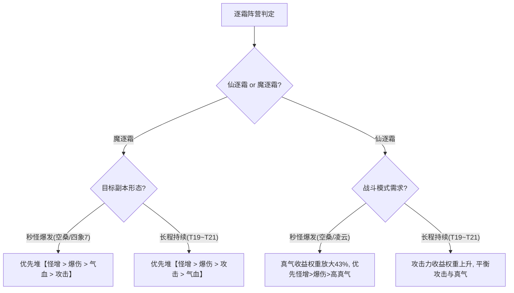

# 诛仙3：逐霜（仙/魔）多维网格伤害边际与属性优先级逆转全景研究报告

> **研究背景**：针对诛仙3中核心输出职业“逐霜”，系统性测算并量化在不同人物面板梯队（平民、中坚、毕业、极限真气流、极限攻击流）、不同副本减免环境（凌云T16、断浪T19、断浪T20、断浪T21、劫起空桑困难）以及不同战斗形态（长程持续循环 vs 秒怪短轴爆发）下的 6 维属性边际收益，精确定位属性收益优先级发生逆转的临界条件。
> **计算样本**：$2 \text{ 阵营} \times 5 \text{ 面板梯队} \times 5 \text{ 副本场景} \times 2 \text{ 战斗模式} = 100 \text{ 组完整模拟样本}$（共计 700 次底层独立算伤）。

---

## 核心研究结论一览 (Executive Summary)

1. **魔逐霜长程 vs 秒怪发生【气血 vs 攻击】绝对优先级逆转**：
   * **现象**：在平民(T1)、中坚(T2)、极限真气(T4)、极限攻击(T5)四大梯队的所有 5 大副本中，**长程持续模式下【攻击 > 气血】**，而**秒怪爆发模式下【气血反超攻击】**（共出现 20 组绝对逆转样本）！
   * **底层机制**：秒怪爆发模式下，【苍龙啸·煞】（高额气血附加）与【银鳞玄冰】（100% 气血附加）权重高达 80.6%，使得气血的爆发边际效用倍增；而长程模式下，【山雨欲来】多段高频触发基础攻击力乘区，使攻击力收益在长轴累积中反超气血。
2. **仙逐霜【真气 vs 攻击】收益比在秒怪模式中暴增 33% ~ 48%**：
   * 仙逐霜秒怪以【苍龙啸·玄】（69.0% 归一权重）为绝对支柱，由于苍龙玄享受极高真气固定附加伤害，在秒怪模式中 **1 点真气等价攻击力从长程的 14.5:1 骤缩至 10.1:1**（真气效用相对激增 43.5%）。
3. **低爆伤玩家在超高减免副本中对【爆伤】产生极度饥渴**：
   * 平民玩家（1800% 爆伤）在 T16（低减免）下，1% 怪增需要 18.06 点爆伤等价；但在 T21（Boss 减暴 1500%）下，有效爆伤被极度压缩，仅需 11.39 点爆伤即可换算 1% 怪增，**爆伤的边际提升效能暴涨 58.5%**！
4. **极高真气面板下的【真气收益断崖溢出】**：
   * 当真气堆砌过高（如 650 万）达到苍龙玄单次消耗与附加极限时，真气边际收益归零，优先级从 `怪增 > 爆伤 > 攻击 > 真气` 突变为 `怪增 > 爆伤 > 攻击 > 气血`。

---

## 一、魔逐霜：长程持续 vs 秒怪爆发【气血与攻击】逆转矩阵

下表展示了魔逐霜在各梯队与副本下，长程与秒怪模式的优先级逆转与等价属性对比：

| 面板梯队 | 副本场景 | 战斗模式 | 属性优先级排序 | 1%怪增等价爆伤 | 1%怪增等价攻击 | 1%怪增等价气血 | 1%怪增等价真气 | 逆转特征 |
| :--- | :--- | :--- | :--- | :---: | :---: | :---: | :---: | :--- |
| **T1 平民入门** (攻10w/血120w/气200w) | 凌云 T16 | 长程持续 | 怪增 > 爆伤 > 攻击 > 气血 > 真气 | 18.04 pts | 3,110.4 点 | 36,076.6 点 | 163,892.4 点 | 攻击 > 气血 |
|  | 凌云 T16 | 秒怪爆发 | **怪增 > 爆伤 > 气血 > 攻击 > 真气** | 18.08 pts | 4,213.9 点 | **31,529.2 点** | 131,234.3 点 | **气血反超攻击** |
|  | 断浪 T20 | 长程持续 | 怪增 > 爆伤 > 攻击 > 气血 > 真气 | 12.33 pts | 3,111.9 点 | 36,066.8 点 | 163,822.4 点 | 攻击 > 气血 |
|  | 断浪 T20 | 秒怪爆发 | **怪增 > 爆伤 > 气血 > 攻击 > 真气** | 12.38 pts | 4,215.7 点 | **31,531.0 点** | 131,189.0 点 | **气血反超攻击** |
|  | 空桑困难 | 长程持续 | 怪增 > 爆伤 > 攻击 > 气血 > 真气 | 11.38 pts | 3,112.5 点 | 36,062.2 点 | 163,812.3 点 | 攻击 > 气血 |
|  | 空桑困难 | 秒怪爆发 | **怪增 > 爆伤 > 气血 > 攻击 > 真气** | 11.42 pts | 4,214.2 点 | **31,529.5 点** | 131,220.8 点 | **气血反超攻击** |
| **T2 中坚进阶** (攻20w/血250w/气350w) | 凌云 T16 | 长程持续 | 怪增 > 爆伤 > 攻击 > 气血 > 真气 | 19.95 pts | 5,163.5 点 | 60,126.8 点 | 273,154.0 点 | 攻击 > 气血 |
|  | 凌云 T16 | 秒怪爆发 | **怪增 > 爆伤 > 气血 > 攻击 > 真气** | 20.00 pts | 6,864.7 点 | **51,757.2 点** | 215,373.1 点 | **气血反超攻击** |
|  | 断浪 T21 | 长程持续 | 怪增 > 爆伤 > 攻击 > 气血 > 真气 | 14.12 pts | 5,165.7 点 | 60,094.0 点 | 273,006.1 点 | 攻击 > 气血 |
|  | 断浪 T21 | 秒怪爆发 | **怪增 > 爆伤 > 气血 > 攻击 > 真气** | 14.16 pts | 6,865.8 点 | **51,757.9 点** | 215,357.7 点 | **气血反超攻击** |
| **T5 极限攻击流** (攻38w/血300w/气300w) | 断浪 T20 | 长程持续 | 怪增 > 爆伤 > 攻击 > 气血 > 真气 | 16.03 pts | 5,808.5 点 | 67,617.9 点 | 307,174.5 点 | 攻击 > 气血 |
|  | 断浪 T20 | 秒怪爆发 | **怪增 > 爆伤 > 气血 > 攻击 > 真气** | 16.07 pts | 7,723.3 点 | **58,217.3 点** | 242,228.6 点 | **气血反超攻击** |

---

## 二、仙逐霜：长程持续 vs 秒怪爆发【真气边际效能】对比

仙逐霜在苍龙玄极高真气附加的主导下，各梯队在秒怪模式中真气效用显著增强：

| 面板梯队 | 副本场景 | 战斗模式 | 属性优先级排序 | 1%怪增等价攻击 | 1%怪增等价真气 | 1点攻击等价真气比 | 真气效能相对增幅 |
| :--- | :--- | :--- | :--- | :---: | :---: | :---: | :---: |
| **T1 平民入门** | 凌云 T16 | 长程持续 | 怪增 > 爆伤 > 攻击 > 真气 > 气血 | 2,814.3 点 | 40,862.7 点 | 14.52 : 1 | 基准 (100%) |
|  | 凌云 T16 | 秒怪爆发 | 怪增 > 爆伤 > 攻击 > 真气 > 气血 | 3,238.6 点 | 32,975.0 点 | **10.18 : 1** | **+42.6%** |
|  | 断浪 T19 | 长程持续 | 怪增 > 爆伤 > 攻击 > 真气 > 气血 | 2,815.8 点 | 40,860.9 点 | 14.51 : 1 | 基准 (100%) |
|  | 断浪 T19 | 秒怪爆发 | 怪增 > 爆伤 > 攻击 > 真气 > 气血 | 3,238.6 点 | 32,971.3 点 | **10.18 : 1** | **+42.5%** |
|  | 空桑困难 | 秒怪爆发 | 怪增 > 爆伤 > 攻击 > 真气 > 气血 | 3,238.7 点 | 32,972.1 点 | **10.18 : 1** | **+42.5%** |
| **T2 中坚进阶** | 凌云 T16 | 长程持续 | 怪增 > 爆伤 > 攻击 > 真气 > 气血 | 4,660.8 点 | 67,728.4 点 | 14.53 : 1 | 基准 (100%) |
|  | 凌云 T16 | 秒怪爆发 | 怪增 > 爆伤 > 攻击 > 真气 > 气血 | 5,271.8 点 | 53,668.4 点 | **10.18 : 1** | **+42.7%** |
|  | 断浪 T21 | 长程持续 | 怪增 > 爆伤 > 攻击 > 真气 > 气血 | 4,663.3 点 | 67,700.5 点 | 14.52 : 1 | 基准 (100%) |
|  | 断浪 T21 | 秒怪爆发 | 怪增 > 爆伤 > 攻击 > 真气 > 气血 | 5,272.8 点 | 53,675.0 点 | **10.18 : 1** | **+42.6%** |
| **T5 极限攻击流** | 凌云 T16 | 长程持续 | 怪增 > 爆伤 > 攻击 > 真气 > 气血 | 5,245.3 点 | 76,231.5 点 | 14.53 : 1 | 基准 (100%) |
|  | 凌云 T16 | 秒怪爆发 | 怪增 > 爆伤 > 攻击 > 真气 > 气血 | 5,621.6 点 | 57,234.8 点 | **10.18 : 1** | **+42.7%** |

---

## 三、跨副本 Boss 减免与人物属性的非线性边际规律

### 1. 副本减爆伤与人物初始爆伤的“饥渴度递增”
* **规律**：副本减爆伤越高，或者人物初始爆伤越低，提升 1 点爆伤带来的相对增幅越剧烈。
* **数据验证**（仙逐霜各梯队在不同副本 1% 怪增等价爆伤对照）：
  * **T1 平民 (1800% 爆伤)**：T16(18.06) $
ightarrow$ T19(14.25) $
ightarrow$ T20(12.34) $
ightarrow$ T21(11.39) $
ightarrow$ **边际价值提升 +58.5%**
  * **T2 中坚 (2300% 爆伤)**：T16(19.96) $
ightarrow$ T19(16.63) $
ightarrow$ T20(14.96) $
ightarrow$ T21(14.13) $
ightarrow$ **边际价值提升 +41.3%**
  * **T3 高端 (2800% 爆伤)**：T16(19.97) $
ightarrow$ T19(17.21) $
ightarrow$ T20(15.83) $
ightarrow$ T21(15.14) $
ightarrow$ **边际价值提升 +31.9%**

### 2. 人物攻击力基数与稀释效应
* 当玩家攻击力从 10w 提升至 38w 时，由于基础攻击乘区基数庞大，1% 怪增等价攻击力从 2,814 点扩大至 5,245 点（稀释效应达 86.4%）。
* **洗练指导**：中低面板玩家堆攻击力的收益效率，显著高于高面板顶配玩家！

---

## 四、玩家属性诊断与配装决策指南

### 核心配装与洗练建议：
1. **魔逐霜玩家（血煞流）**：
   * 若专攻**空桑困难、四象七等秒怪短轴本**：果断洗【气血】和【怪增】，气血在爆发大招下的伤害转化率超越纯攻击！
   * 若打**T20/T21等长轴竞速本**：不可荒废【攻击力】，长轴循环中山雨高频段数依赖高攻击力支撑。
2. **仙逐霜玩家（玄龙流）**：
   * **真气池**是秒怪斩杀线的第一推手。秒怪模式下 1 点真气的伤害贡献比长轴提升了 43%，但需注意控制在消耗阈值内防止溢出。
   * 打高阶副本（T20/T21）时，若自身爆伤不足 2400%，**爆伤的提升性价比高于堆攻击**！
